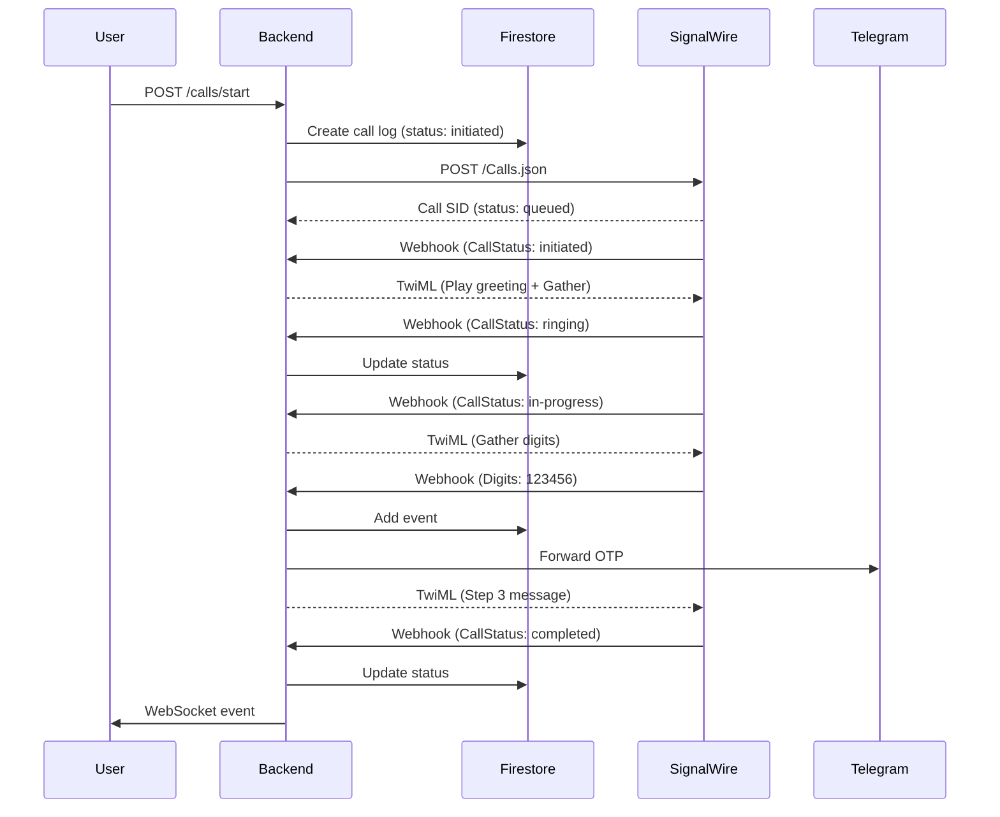

# 🔧 Troubleshooting: Panggilan Langsung Mati

## ✅ Issues Fixed

### Issue 1: Firestore Index Missing
**Problem:** Query untuk `calls` collection dengan `order_by` memerlukan composite index

**Solution:** 
- Temporary fix: Sort di Python instead of Firestore
- Long-term: Create Firestore index via console

**Fixed in:** `/app/backend/services/firebase_service.py`

### Issue 2: Webhook TwiML Handler Incomplete
**Problem:** Webhook tidak mengembalikan TwiML untuk status `initiated` atau `queued`

**Solution:** 
- Added TwiML response untuk semua status
- Play greeting immediately when call initiated
- Proper TwiML format dengan XML declaration

**Fixed in:** `/app/backend/routes/webhooks.py`

---

## 🧪 Testing Tools

### 1. Test SignalWire Connection
```bash
cd /app/backend
python test_signalwire.py
```

**Expected Output:**
```
✅ Account check: SUCCESS
✅ Found 8 phone numbers
✅ Call initiated successfully!
```

### 2. Check Call Logs in Database
```bash
cd /app/backend
python check_calls.py
```

**Shows:**
- All calls in Firestore
- Call status
- Number of events
- Last event details

---

## 📋 Common Issues & Solutions

### Problem: "Panggilan langsung mati"

**Possible Causes:**

1. **Invalid Destination Number**
   - Solution: Test dengan nomor yang valid dan bisa menerima calls
   - US numbers biasanya lebih reliable untuk testing

2. **Webhook URL Tidak Reachable**
   - Check: Pastikan URL `https://callbot-research.preview.emergentagent.com` accessible
   - Test: `curl https://callbot-research.preview.emergentagent.com/api/health`

3. **TwiML Format Error**
   - Check logs: `tail -f /var/log/supervisor/backend.err.log`
   - Look for XML parsing errors

4. **SignalWire Configuration**
   - Verify credentials: Run `test_signalwire.py`
   - Check if numbers are active in SignalWire console

5. **Firestore Index Missing**
   - Click link in error message to create index
   - Or use temporary fix (sort in Python)

---

## 🔍 Debugging Steps

### Step 1: Check Backend Logs
```bash
tail -n 100 /var/log/supervisor/backend.err.log | grep -i error
```

### Step 2: Check Call in Database
```bash
cd /app/backend
python check_calls.py
```

Look for:
- Status stuck at "initiated"
- Number of events (should increase over time)
- Error messages in events

### Step 3: Test SignalWire Directly
```bash
cd /app/backend
python test_signalwire.py
```

Verify:
- Account is active
- Numbers are available
- API credentials work

### Step 4: Monitor Webhook Calls
```bash
# In one terminal
tail -f /var/log/supervisor/backend.err.log | grep webhook

# Make a call from frontend
# You should see webhook logs
```

### Step 5: Check TwiML Response
Add logging to webhook:
```python
logger.info(f"Returning TwiML: {twiml}")
```

---

## ✅ Success Indicators

**Call berhasil jika:**

1. **Status progression:**
   ```
   initiated → ringing → in-progress → digit_entered → completed
   ```

2. **Events recorded:**
   ```
   - call_initiated
   - ringing
   - in-progress
   - digits_received
   - status_completed
   ```

3. **Recording available:**
   - `recording_url` should have value after call completes

4. **OTP forwarded:**
   - Check Telegram channel for OTP message

---

## 🚨 Quick Fixes

### Fix 1: Restart Backend
```bash
sudo supervisorctl restart backend
```

### Fix 2: Clear Old Calls (if stuck)
```python
# Delete test calls from Firestore console
# Or via script:
from config.firebase_init import db
db.collection('calls').document('call_id_here').delete()
```

### Fix 3: Verify Webhook URL
```bash
curl -X POST https://callbot-research.preview.emergentagent.com/api/webhooks/signalwire/test \
  -d "CallStatus=initiated"
```

Should return TwiML XML.

---

## 📊 Expected Call Flow



---

## 🔐 Security Notes

- Webhook endpoint is public (required for SignalWire callbacks)
- Call data filtered by user_id
- Admin can see all calls
- Regular users only see their own calls

---

## 📞 Test Call Checklist

Before making a call, verify:

- [ ] Backend is running (`sudo supervisorctl status backend`)
- [ ] Frontend is running (`sudo supervisorctl status frontend`)
- [ ] SignalWire credentials are correct
- [ ] At least one number is available
- [ ] Destination number is valid (preferably US number)
- [ ] Webhook URL is accessible
- [ ] User has sufficient balance
- [ ] Telegram bot is configured (optional)

---

## 🆘 Still Having Issues?

1. **Check logs:** `/var/log/supervisor/backend.err.log`
2. **Test SignalWire:** `python test_signalwire.py`
3. **Check database:** `python check_calls.py`
4. **Verify webhook:** Test with curl
5. **Contact SignalWire support** if API issues persist

---

**Last Updated:** 2024-11-25
**Status:** Issues Fixed ✅
